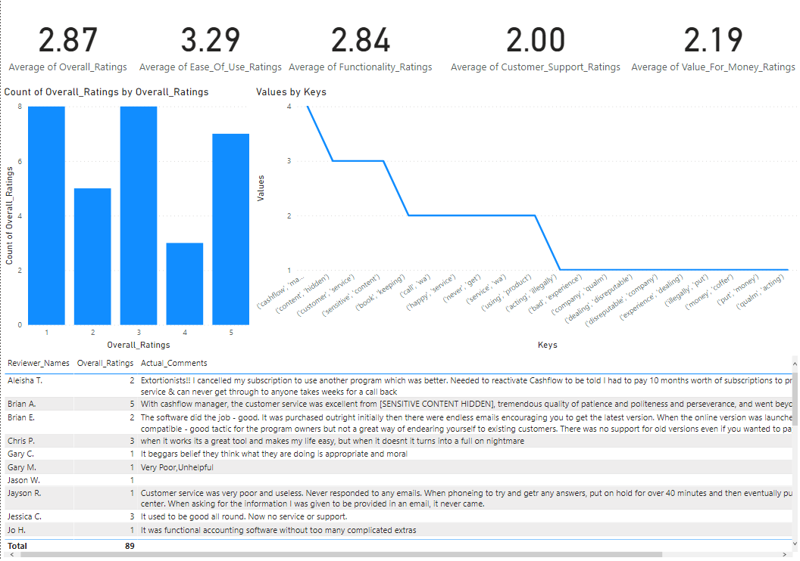

```python
from requests import get
page1_url = 'https://www.capterra.com.au/reviews/111640/cashflow-manager'
page1_response = get(page1_url)
page2_url = 'https://www.capterra.com.au/reviews/111640/cashflow-manager?page=2'
page2_response = get(page1_url)
```


```python
from bs4 import BeautifulSoup
page1_html_soup = BeautifulSoup(page1_response.text, 'html.parser')
page2_html_soup = BeautifulSoup(page2_response.text, 'html.parser')
```


```python
page1_containers = page1_html_soup.find_all('div', class_ = 'i18n-translation_container review-card pt-4 py-3 py-md-5 border-bottom border-primary')
page2_containers = page2_html_soup.find_all('div', class_ = 'i18n-translation_container review-card pt-4 py-3 py-md-5 border-bottom border-primary')

```


```python
# occurrence = 2

# # Finding nth occurrence of substring
# val = -1
# for i in range(0, occurrence):
#     val = str(first_review).find('span', val + 1)
       
# # Printing nth occurrence
# print ("Nth occurrence is at", val)
```


```python
# Lists to store the scraped data in
reviewer_names = []
overall_ratings = []
ease_ratings = []
function_ratings = []
customer_support_ratings = []
value_ratings = []
comment_headings = []
actual_comments = []
positives = []
negatives = []

# Extract data from individual container
for container in page1_containers:
    
    # Reviewer Name
    name = container.h5.text.replace('\n','').replace('    ','')
    reviewer_names.append(name)
    
    # Overall Rating
    overall = int(container.find_all('span', class_ = 'text-nowrap d-inline-block text-right review-stars__text font-weight-bold')[0].text.replace('\n','').replace(' ','').replace('/5',''))
    overall_ratings.append(overall)
    
    # Ease of Use Rating
    ease = int(container.find_all('span', class_ = 'text-nowrap d-inline-block text-right review-stars__text font-weight-bold')[1].text.replace('\n','').replace(' ','').replace('/5',''))
    ease_ratings.append(ease)
    
    # Features and Functions Ratings
    function = int(container.find_all('span', class_ = 'text-nowrap d-inline-block text-right review-stars__text font-weight-bold')[2].text.replace('\n','').replace(' ','').replace('/5',''))
    function_ratings.append(function)
    
    # Customer Support Ratings
    try:
        support = int(container.find_all('span', class_ = 'text-nowrap d-inline-block text-right review-stars__text font-weight-bold')[3].text.replace('\n','').replace(' ','').replace('/5',''))
        customer_support_ratings.append(support)
    except:
        customer_support_ratings.append('')
        
    # Value for Money Ratings
    try:
        value = int(container.find_all('span', class_ = 'text-nowrap d-inline-block text-right review-stars__text font-weight-bold')[4].text.replace('\n','').replace(' ','').replace('/5',''))
        value_ratings.append(value)
    except:
        value_ratings.append('')
    
    # Comment Heading
    heading = container.h3.text.replace('"','')
    comment_headings.append(heading)
    
    # Actual Comment
    comment = container.find_all('span')[-5].text
    actual_comments.append(comment)
    
    # Positive Note
    positive_note = container.find_all('span')[-4].text
    positives.append(positive_note)
    
    # Negative Note
    negative_note = container.find_all('span')[-3].text
    negatives.append(negative_note)

for container in page2_containers:
    
    # Reviewer Name
    name = container.h5.text.replace('\n','').replace('    ','')
    reviewer_names.append(name)
    
    # Overall Rating
    overall = int(container.find_all('span', class_ = 'text-nowrap d-inline-block text-right review-stars__text font-weight-bold')[0].text.replace('\n','').replace(' ','').replace('/5',''))
    overall_ratings.append(overall)
    
    # Ease of Use Rating
    ease = int(container.find_all('span', class_ = 'text-nowrap d-inline-block text-right review-stars__text font-weight-bold')[1].text.replace('\n','').replace(' ','').replace('/5',''))
    ease_ratings.append(ease)
    
    # Features and Functions Ratings
    function = int(container.find_all('span', class_ = 'text-nowrap d-inline-block text-right review-stars__text font-weight-bold')[2].text.replace('\n','').replace(' ','').replace('/5',''))
    function_ratings.append(function)
    
    # Customer Support Ratings
    try:
        support = int(container.find_all('span', class_ = 'text-nowrap d-inline-block text-right review-stars__text font-weight-bold')[3].text.replace('\n','').replace(' ','').replace('/5',''))
        customer_support_ratings.append(support)
    except:
        customer_support_ratings.append('')
        
    # Value for Money Ratings
    try:
        value = int(container.find_all('span', class_ = 'text-nowrap d-inline-block text-right review-stars__text font-weight-bold')[4].text.replace('\n','').replace(' ','').replace('/5',''))
        value_ratings.append(value)
    except:
        value_ratings.append('')
    
    # Comment Heading
    heading = container.h3.text.replace('"','')
    comment_headings.append(heading)
    
    # Actual Comment
    comment = container.find_all('span')[-5].text
    actual_comments.append(comment)
    
    # Positive Note
    positive_note = container.find_all('span')[-4].text
    positives.append(positive_note)
    
    # Negative Note
    negative_note = container.find_all('span')[-3].text
    negatives.append(negative_note)
```


```python
import pandas as pd
df = pd.DataFrame({'Reviewer_Names': reviewer_names,
                   'Overall_Ratings': overall_ratings,
                   'Ease_Of_Use_Ratings': ease_ratings,
                   'Functionality_Ratings': function_ratings,
                   'Customer_Support_Ratings': customer_support_ratings,
                   'Value_For_Money_Ratings': value_ratings,
                   'Comment_Headings': comment_headings,
                   'Actual_Comments': actual_comments,
                   'Postive_Notes': positives,
                   'Negative_Note': negatives
                   })
df = df.drop_duplicates()
df.head(3)
```


<div>
<style scoped>
    .dataframe tbody tr th:only-of-type {
        vertical-align: middle;
    }

    .dataframe tbody tr th {
        vertical-align: top;
    }

    .dataframe thead th {
        text-align: right;
    }
</style>
<table border="1" class="dataframe">
  <thead>
    <tr style="text-align: right;">
      <th></th>
      <th>Reviewer_Names</th>
      <th>Overall_Ratings</th>
      <th>Ease_Of_Use_Ratings</th>
      <th>Functionality_Ratings</th>
      <th>Customer_Support_Ratings</th>
      <th>Value_For_Money_Ratings</th>
      <th>Comment_Headings</th>
      <th>Actual_Comments</th>
      <th>Postive_Notes</th>
      <th>Negative_Note</th>
    </tr>
  </thead>
  <tbody>
    <tr>
      <th>0</th>
      <td>Warren R.</td>
      <td>3</td>
      <td>4</td>
      <td>3</td>
      <td>1</td>
      <td>1</td>
      <td>Worked well for a number of years but earlier ...</td>
      <td>\n\n\n\n</td>
      <td>For a simple business, Cashflow Manager Gold w...</td>
      <td>Perhaps, with cost being a factor in our initi...</td>
    </tr>
    <tr>
      <th>1</th>
      <td>Peter S.</td>
      <td>3</td>
      <td>3</td>
      <td>3</td>
      <td>1</td>
      <td>3</td>
      <td>Beware of This Company</td>
      <td>Very bad experience dealing with a disreputabl...</td>
      <td>I bought this software several years ago after...</td>
      <td>Be prepared to be harassed by this company. Af...</td>
    </tr>
    <tr>
      <th>2</th>
      <td>Russell H.</td>
      <td>3</td>
      <td>3</td>
      <td>3</td>
      <td>1</td>
      <td>1</td>
      <td>Very disappointed</td>
      <td>I used Cashflow Manager for many years without...</td>
      <td>Was fairly easy to use and my accountant was a...</td>
      <td>They implemented yearly subscription fees afte...</td>
    </tr>
  </tbody>
</table>
</div>


```python
df.to_excel("reviews.xlsx")
```


```python
from nltk.corpus import reuters, stopwords
from nltk.util import ngrams
from nltk.tokenize import word_tokenize
from nltk.stem import WordNetLemmatizer
import re
```


```python
lemmatizer = WordNetLemmatizer()
```


```python
def process_text(comment):
    sw = set(stopwords.words('english'))
    regex = re.compile("[^a-zA-Z ]")
    re_clean = regex.sub('', comment)
    words = word_tokenize(re_clean)
    lem = [lemmatizer.lemmatize(word) for word in words]
    output = [word.lower() for word in lem if word.lower() not in sw]
    return output
```


```python
processed = []
for each_comment in df['Actual_Comments'].tolist():
    processed.append(process_text(each_comment))
processed = [item for sublist in processed for item in sublist]
```


```python
# Import Counter
from collections import Counter

# Get bigram count
bigram_counts = Counter(ngrams(processed, n=2))
# print(dict(bigram_counts))

# Print top x bigrams
print(dict(bigram_counts.most_common(10)))
```

    {('cashflow', 'manager'): 4, ('customer', 'service'): 3, ('sensitive', 'content'): 3, ('content', 'hidden'): 3, ('never', 'get'): 2, ('service', 'wa'): 2, ('call', 'wa'): 2, ('using', 'product'): 2, ('happy', 'service'): 2, ('book', 'keeping'): 2}
    


```python
# Get word counts
word_counts = Counter(processed)
#print(dict(word_counts))

# Get top x words
print(dict(word_counts.most_common(20)))
```

    {'wa': 15, 'product': 6, 'customer': 6, 'support': 6, 'service': 6, 'cashflow': 5, 'call': 5, 'manager': 4, 'pay': 4, 'good': 4, 'email': 4, 'get': 4, 'old': 4, 'subscription': 4, 'business': 4, 'never': 4, 'happy': 4, 'put': 3, 'year': 3, 'without': 3}
    


```python
import matplotlib.pyplot as plt
keys = dict(bigram_counts.most_common(20)).keys()
values = dict(bigram_counts.most_common(20)).values()
bigram_df = pd.DataFrame({'Keys':keys,
                          'Values':values})
fig, ax = plt.subplots()
bigram_df.plot(kind='line',x='Keys',y='Values',figsize=(15,6),legend=False,ax=ax);
ax.set_xticks(range(len(bigram_df.Keys)));
ax.set_xticklabels(bigram_df.Keys.values.tolist(), rotation=90);
```


    

    


```python
bigram_df.to_excel("bigrams.xlsx", index=False)
```
